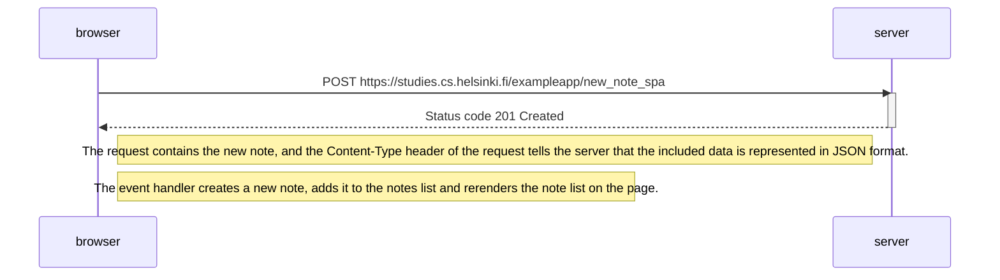

```mermaid
sequenceDiagram
participant browser
participant server

    browser->>server: POST https://studies.cs.helsinki.fi/exampleapp/new_note_spa
    activate server
    server-->>browser: Status code 201 Created
    deactivate server

    Note right of browser: The request contains the new note, and the Content-Type header of the request tells the server that the included data is represented in JSON format.

    Note right of browser: The event handler creates a new note, adds it to the notes list and rerenders the note list on the page.
```
